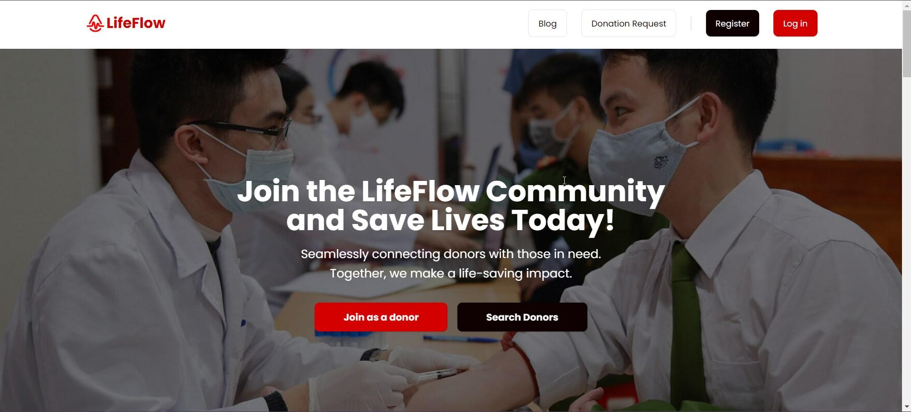

# LifeFlow

Connecting Lives, One Donation at a Time

[Live Website](https://lifeflowclient.web.app)

## Introduction

The LifeFlow Blood Donation Application is a user-friendly platform that facilitates blood donation activities. It connects donors with those in need, streamlining the donation process. Built using the MERN stack (MongoDB, Express.js, React, Node.js), it includes features for user registration, blood donation requests, donor management, content management, and role-based access control.

## ✅ Features

1. **Radix UI Dialog**
2. **Stripe React and Stripe JS**
3. **Tanstack React Query**
4. **AOS (Animate on Scroll)**
5. **Axios**
6. **DayJS**
7. **Firebase**
8. **Jodit React**
9. **React**
10. **React Router DOM**
11. **React Spinners**
12. **React to PDF**
13. **SweetAlert2**
14. **Swiper**

## License

This project is licensed under the GNU General Public License v3.0 - see the [LICENSE](./LICENSE) file for details.